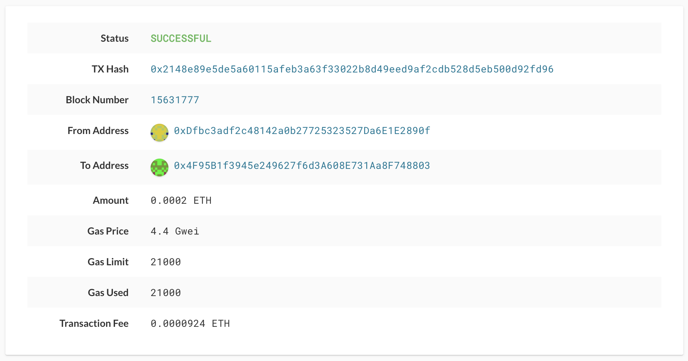

# Local Wallet Generator for BTC-Testnet & ETH-Testnet

This project generates accounts for both Bitcoin and Ethereum from private keys, that can then be used to transact with.

## Prerequisites

The installation of the pip dependencies "bit" and "web3" are as follows:

```
$ pip install bit
```

That command will install bit to be used with python. Use the following command to confirm installation, as well as finding out which version of bit was installed:

```
$ pip list | grep bit
```

To install web3, the command is as follows:

```
$ pip install web3
```

Similar to the bit library, that command will install web3 to be used with python. To confirm the installation, as well as checking the installed version, enter as follows:

```
$ pip list | grep web3
```

To clone and install the hd-wallet derive, enter the following:

```
$ git clone https://github.com/dan-da/hd-wallet-derive
$ cd hd-wallet-derive
$ php -r "readfile('https://getcomposer.org/installer');" | php
$ php composer.phar install
```

Lastly, you need to create a symlink called "derive" for the hd-wallet-derive/hd-wallet-derive.php script into the top level project directory like so: 

```
$ ln -s hd-wallet-derive/hd-wallet-derive.php derive
```

## Running the tests

You simply run the wallet/wallet.py file from the command line using python.

```
$ python wallet.py
```

### Break down into end to end tests

Below is an image of a valie BTC-testnet transaction.


The code to run the transaction above is as follows:

```
send_tx(BTCTEST, btc_accounts["account_01"], btc_accounts["account_02"], 0.00003)
```

(The code in that above instance could be altered to have transactions occur with different accounts. for example "account_02" and "account_03".)

Below is an image of a valid ETH-testnet transaction.



The code to run the transaction above is as follows:

```
send_tx(ETH, eth_accounts["account_01"], eth_accounts["account_02"], 200000000000000s)
```

(The code in that above instance could be altered to have transactions occur with different accounts. for example "account_02" and "account_03".)

## Built With

* [python](https://www.python.org/) - Programming language.
* [hd-wallet-derive](https://github.com/dan-da/hd-wallet-derive) - CLI tool that derives bip32 addresses and private keys.
* [Bit](https://ofek.dev/bit/) - Python Bitcoin library.
* [web3.py](https://github.com/ethereum/web3.py) - Python Ethereum library.
* [Infura](https://infura.io/) - API used to access the Ethereum and IPFS networks.
* [subprocess](https://docs.python.org/3/library/subprocess.html) - Module that allows you to spawn new processes, connect to their input/output/error pipes, and obtain their return codes.

## Authors

* **Roberto Cantu**  - [GitHub](https://github.com/RCantu92)